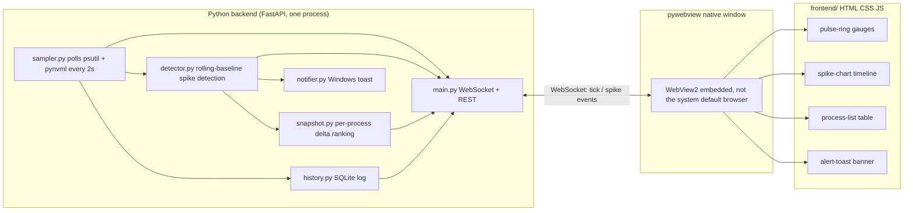

# PulseGuard — Project Plan

*A Windows desktop resource watchdog: Python backend, web-native UI, packaged as a real Windows installer.*

**Repository:** [github.com/Trukitro/PulseGuard](https://github.com/Trukitro/PulseGuard) (public, currently empty — this plan is meant to seed it)

```bash
git remote add origin https://github.com/Trukitro/PulseGuard.git
git branch -M main
git push -u origin main
```

---

## 1. What this is

A background app that watches RAM / CPU / NVIDIA GPU usage, detects sudden spikes (not just high totals), tells you which process caused it, and shows it all in a native-feeling desktop window built with real HTML/CSS/JS — not tkinter, not customtkinter.

---

## 2. Tech stack decision

| Layer | Choice | Why |
|---|---|---|
| Backend core | Python 3.11+, `psutil`, `pynvml` (`nvidia-ml-py`) | Already validated in the earlier prototype |
| Local server | `FastAPI` + `uvicorn`, one WebSocket endpoint | Streams live ticks to the UI; REST for settings/history. Lets you develop the UI in a normal Chrome tab against `localhost:8731` — no rebuild needed while iterating |
| Desktop shell | `pywebview` | Thin native window wrapping the local server. Uses Windows' built-in **WebView2** (Edge/Chromium engine), so no bundled Chromium, small exe |
| Frontend | Plain HTML/CSS/JS using native **Web Components** (Custom Elements + Shadow DOM) | Full design control, no framework/build-step lock-in |
| UI component library | **`@fluentui/web-components`** (Microsoft's FAST-based Fluent 2 web components) | This is the actual "fluent" look — real Microsoft Fluent Design controls as `<fluent-button>`, `<fluent-card>`, etc., usable straight in HTML |
| Charts | `Chart.js` (via CDN or vendored) | Lightweight, good live-updating line charts for the spike timeline |
| Toast alerts | `winotify` | Native Windows toast notifications |
| History storage | SQLite (stdlib `sqlite3`) | Zero-dependency, queryable later |
| Packaging | `PyInstaller` (`--onedir`) | Bundles Python + backend + frontend assets into a folder of exe + DLLs |
| Installer | **Inno Setup** | Wizard UI, Start Menu + desktop shortcuts, optional autostart, uninstaller, WebView2 runtime check |
| CI/CD | GitHub Actions (`windows-latest`) | Auto-build exe + installer on tag push, attach to GitHub Release |

---

## 3. Architecture



Key point: the backend is a normal local web server. During development you literally open `http://127.0.0.1:8731` in Chrome and build the UI there with DevTools — `pywebview` only gets bolted on at the very end to turn it into a "real app" with no browser chrome, taskbar icon, and offline-only binding to localhost.

---

## 4. Repo structure

```
pulseguard/
├── assets/
│   ├── icon.ico                # multi-res app icon — exe, installer, taskbar, shortcuts
│   └── logo.svg                # in-app logo
├── backend/
│   ├── app/
│   │   ├── __init__.py
│   │   ├── main.py            # FastAPI app, /ws, /api/settings, /api/history
│   │   ├── sampler.py         # psutil + pynvml polling loop
│   │   ├── detector.py        # rolling baseline + threshold logic
│   │   ├── snapshot.py        # process delta ranking (RAM + VRAM)
│   │   ├── notifier.py        # winotify wrapper
│   │   ├── history.py         # SQLite read/write
│   │   ├── settings.py        # user thresholds, persisted to disk
│   │   └── shell.py           # pywebview bootstrap, single-instance lock
│   ├── requirements.txt
│   └── pulseguard.spec        # PyInstaller spec file
├── frontend/
│   ├── index.html
│   ├── css/tokens.css         # design tokens
│   ├── js/ws-client.js        # WebSocket reconnect + event bus
│   ├── js/nav-guard.js        # blocks/redirects external link handling (see §7)
│   └── js/components/
│       ├── pulse-ring.js
│       ├── spike-chart.js
│       ├── process-list.js
│       └── alert-toast.js
│   └── vendor/                # @fluentui/web-components, chart.js (checked in, no npm at build time)
├── installer/
│   └── pulseguard.iss         # Inno Setup script
├── .github/workflows/release.yml
├── README.md
├── LICENSE
└── CHANGELOG.md
```

---

## 5. WebSocket / API contract

Keep this explicit so backend and frontend can be built independently.

**`ws://127.0.0.1:8731/ws`** — server pushes:
```jsonc
{ "type": "tick", "data": { "ts": 1234567890, "ram_gb": 18.4, "ram_pct": 57.5,
                             "cpu_pct": [12, 34], "gpu_pct": 22, "vram_gb": 3.1 } }

{ "type": "spike", "data": { "ts": 1234567890, "metric": "ram", "from_gb": 18.2, "to_gb": 24.6,
                              "window_s": 22, "top": [ { "name": "chrome.exe", "pid": 4412,
                              "delta_gb": 2.1, "total_gb": 5.8 } ] } }
```

**REST:**
- `GET /api/history?range=1h` → backfill for the chart on load
- `GET/POST /api/settings` → thresholds (absolute % ceiling, delta-GB/window-seconds), autostart toggle, polling interval

---

## 6. Frontend design direction

Since this is a Windows-native monitoring tool, the design should look like it belongs on Windows rather than a generic dark-mode dashboard:

- **Type**: `Segoe UI Variable` for labels/chrome (Windows' own Fluent 2 typeface — free, already on every target machine, and the *correct* choice specifically because this app lives on Windows), paired with a monospace face (`Cascadia Code` or `JetBrains Mono`) for the live numeric telemetry — the way real system tools and terminals set their numbers.
- **Color**: near-black base with a cool undertone (`#0B0E14`), layered panels using acrylic-style translucency (`background: rgba(255,255,255,0.04); backdrop-filter: blur(20px)`), a calm blue accent for normal state (`#2899F5`, Fluent's own blue), amber for warning, red for an active spike.
- **Signature element**: a cluster of three concentric ring gauges (`<pulse-ring>` for RAM/CPU/GPU) sharing one glow animation wired directly to the detector's real spike state — the ring visibly pulses harder exactly when, and because, a real spike is firing. Everything else (settings, process table, history) stays quiet — plain Fluent cards/buttons, no extra ornamentation.
- **Logo placement**: your provided logo sits in the app header/title area (see §8) and optionally in a small "About" panel — not scattered across every screen.

---

## 7. Feels like a native app, not a browser

This is guaranteed by the `pywebview` shell chosen in §2/§3, but worth being explicit about since it's easy to get wrong if a coding agent isn't told:

- `pywebview` never opens Chrome/Edge/Firefox as a separate window. It renders WebView2 *inside a native Win32 window your app owns* — no address bar, no tabs, no bookmarks bar, no browser chrome at all. The taskbar entry shows whatever title and icon you set (§8), not "Edge" or "Chrome."
- The FastAPI server binds to `127.0.0.1` only, and nothing in the app calls `webbrowser.open()` — so there's no code path that could pop the user's actual default browser on its own.
- **The one real risk**: a stray `<a>` tag or `window.open()` call in the frontend JS. Left unhandled, WebView2 will hand external navigation off to the real default browser — that's the one legitimate way a "browser" could visibly appear. Fix: `frontend/js/nav-guard.js` intercepts all navigation/`window.open` calls and blocks them by default; only explicit, intentional exceptions (e.g. a "View on GitHub" link in an About panel) get routed to `webbrowser.open()` from the Python side on purpose.
- Right-click → "Inspect"/DevTools is available by default while `pywebview` runs in debug mode; set `debug=False` for release builds so the shipped app never exposes a raw browser-devtools surface.
- Window chrome: keep the native Windows title bar (simplest — and it already has zero browser UI, so it won't read as a browser) or go `frameless=True` for a fully custom title bar with your logo baked in. Native chrome is the pragmatic default; frameless is extra polish, not a requirement for the "feels native" goal.
- Single-instance behavior: use a named mutex (or a lock file / "is this port already answering" check) in `shell.py` so double-clicking the exe or a desktop icon while it's already running just focuses the existing window instead of opening a second one — reinforces "this is an app," not a page you can open N times.

---

## 8. Branding & icons — status: done

Icon and logo are already designed and match the design tokens from §6 exactly (same `#2899F5` Fluent blue / `#FFB900` amber / `#E81123` red ring colors, same `#0B0E14` background) — the concentric-ring icon is effectively the `<pulse-ring>` signature element rendered as a mark, a good sign the visual identity is coherent end to end.

| File | Source | Committed to `assets/` as |
|---|---|---|
| App icon (source) | `PulseGardIcon.svg` | `assets/icon.svg` |
| App icon (Windows-ready) | rasterized from the SVG at 16/32/48/256px and packed | `assets/icon.ico` |
| Logo (source, used in-app) | `PulseGardLogo.svg` | `assets/logo.svg` |
| Logo (raster, for README) | rendered at 800×256 | `assets/logo.png` |

`icon.ico` is a real multi-resolution Windows icon (4 embedded sizes), ready to reference as-is — no further conversion needed. Wire it into the three places from §7/§9:
- `pulseguard.spec` → `icon='../assets/icon.ico'`
- `pulseguard.iss` → `SetupIconFile=..\assets\icon.ico`
- `shell.py` → `webview.create_window(title="PulseGuard", icon='../assets/icon.ico', ...)`

`logo.svg` goes in the app header (§6) — it's already built as icon + wordmark combined ("Pulse" in white, "Guard" in the accent blue), sized as a 400×128 lockup, so it drops straight into the frontend header without further layout work. `logo.png` is a plain rendered flat version for the GitHub README banner, where inline SVG rendering can be inconsistent.

---

## 9. Packaging

**PyInstaller** (`backend/pulseguard.spec`):
- `--onedir` (not `--onefile`) — faster startup, easier to inspect/debug the bundled tree
- `--add-data "../frontend;frontend"` and `--add-data "../assets;assets"` to bundle the UI and icons
- `--icon "../assets/icon.ico"` so the built exe itself carries the icon
- Hidden imports likely needed: `pynvml`, `uvicorn.loops.auto`, `uvicorn.protocols.http.auto`

**Inno Setup** (`installer/pulseguard.iss`):
- `[Setup]`: AppName, AppVersion (from a version file or CI tag), `DefaultDirName={autopf}\PulseGuard`, `SetupIconFile=..\assets\icon.ico`
- `[Files]`: entire PyInstaller `dist\PulseGuard\*` tree
- `[Tasks]` + `[Icons]` — this is what gives the installer its "create a desktop icon?" checkbox, standard Inno Setup pattern:
  ```
  [Tasks]
  Name: "desktopicon"; Description: "Create a &desktop icon"; GroupDescription: "Additional icons:"

  [Icons]
  Name: "{autoprograms}\PulseGuard"; Filename: "{app}\PulseGuard.exe"; IconFilename: "{app}\assets\icon.ico"
  Name: "{autodesktop}\PulseGuard"; Filename: "{app}\PulseGuard.exe"; Tasks: desktopicon; IconFilename: "{app}\assets\icon.ico"
  ```
  Start Menu shortcut is always created; the desktop shortcut only appears if the user leaves that checkbox ticked on the wizard step (checked by default, but they can uncheck it).
- `[Registry]` (optional, its own checkbox): `HKCU\...\Run` entry for autostart-with-Windows
- WebView2 check: Microsoft publishes an official Inno Setup include for detecting/bootstrapping the WebView2 Runtime — worth using so install still works on the rare machine that lacks it
- `[Run]`: "Launch PulseGuard" checkbox on the finish page

---

## 10. CI/CD (GitHub Actions)

`.github/workflows/release.yml`, triggered on tags matching `v*.*.*`:
1. `windows-latest` runner
2. Checkout, setup Python, `pip install -r backend/requirements.txt`
3. `pyinstaller backend/pulseguard.spec`
4. Install Inno Setup (`choco install innosetup`)
5. Compile `installer/pulseguard.iss` → `PulseGuardSetup.exe`
6. Upload the installer as a **GitHub Release** asset attached to that tag

Shipping a new version becomes: `git tag v1.2.0 && git push --tags`.

---

## 11. Build order (phases)

| Phase | Goal | Done when |
|---|---|---|
| 0 | Repo scaffold, README, LICENSE, `.gitignore` | **Repo created** ([Trukitro/PulseGuard](https://github.com/Trukitro/PulseGuard)), **icon/logo assets ready** in `assets/` — remaining: push folder structure from §4, README, LICENSE, `.gitignore` |
| 1 | Backend core: sampler → detector → snapshot → SQLite history, no server yet | Console script prints live stats and correctly flags a manufactured spike |
| 2 | Wrap in FastAPI + WebSocket | Browser DevTools can connect to `/ws` and see live ticks |
| 3 | Frontend components against the running server in a normal browser tab | Pulse rings, chart, process list, and toast all update live in Chrome |
| 4 | `pywebview` shell + icon/branding + nav-guard + single-instance lock + tray minimize | Double-clicking the built exe opens a chromeless native window with your icon in the taskbar, and stray links don't escape to a browser |
| 5 | PyInstaller build + Inno Setup installer (with desktop-icon checkbox) | A fresh Windows VM can install via the wizard, sees the desktop-icon prompt, and runs it with zero Python installed |
| 6 | GitHub Actions release pipeline, screenshots/GIF in README | Tagging a version produces a downloadable installer automatically |

---

## 12. Decisions to make before handing this to a coding agent

- **Admin rights**: some system/protected processes raise `AccessDenied` in `psutil` without elevation. Options: request UAC elevation at install time (`PrivilegesRequired=admin` in Inno Setup), or run unprivileged and skip/gray-out inaccessible processes. Unprivileged is the friendlier default.
- **Autostart**: on-by-default, opt-in via installer checkbox, or off entirely (toggle later in in-app settings)?
- **Port**: fixed port (e.g. `8731`) with a fallback scan if it's taken.
- **History retention**: how long to keep SQLite rows before pruning (e.g. rolling 30 days).
- **Desktop icon default**: ticked or unticked by default on the installer wizard step (Inno Setup default is ticked — flip with `Flags: unchecked` on the `[Tasks]` line if you'd rather it start off).

---

## 13. Repository access & ownership

Goal: `Trukitro` stays the only account with write/admin access to this repo — no accidental collaborators, no merge rights leaking out through forks or CI.

- **Collaborators**: Settings → Collaborators and teams — keep this list empty. Don't add outside collaborators or teams unless that's a deliberate future decision.
- **Branch protection on `main`**: Settings → Branches → Add rule for `main` → under "Restrict who can push to matching branches," list only `Trukitro`. This blocks direct pushes from anyone else even if they somehow gain repo access later.
- **CODEOWNERS**: add `.github/CODEOWNERS` with a single line `* @Trukitro`, paired with "Require review from Code Owners" in the branch protection rule — no change can merge without explicit approval from that account.
- **Public repo ≠ open write access**: the repo being public just means anyone can fork it and open a pull request — that alone grants zero write access. Still, enable Settings → Actions → "Require approval for first-time contributors" so a stranger's PR can't trigger the GitHub Actions release workflow (burning CI minutes or probing for secrets) without approval first.
- **Actions permissions**: Settings → Actions → General → Workflow permissions → set to "Read repository contents" only, except where the release workflow specifically needs write access to attach installer artifacts to a Release — scope that narrowly rather than granting broad write by default.
- **Secrets**: if a code-signing certificate or API key gets added later (e.g. to sign the installer exe), store it as a repository secret, never commit it, and keep it out of reach of workflows triggered by forked-PR runs.
- **2FA**: confirm two-factor authentication is enabled on the `Trukitro` account itself — that account's login security is the actual root of "who can act as owner," everything above just enforces it at the repo-settings level.

---

This document is written to be given directly to a coding agent (Codex, Claude Code, etc.) as the spec — phase 1 backend can be built and tested completely on its own, in a plain console, before any UI work starts. Sections 7 and 8 (native-app behavior, icons/branding) should be treated as requirements, not nice-to-haves, when that agent builds `shell.py` and the Inno Setup script.
